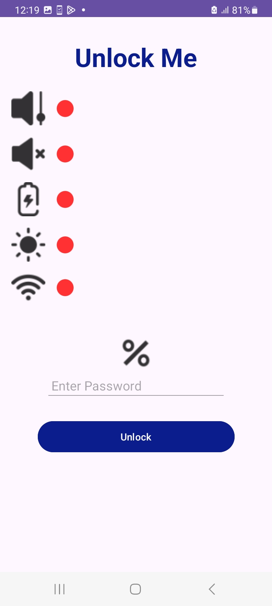

# UnlockMe 🔒

A unique Android application that challenges users to log in by meeting specific environmental conditions! The app checks parameters like Wi-Fi network, volume level, brightness, charging state, and ambient noise level before enabling the login functionality.

---

## Features ✨

- **Wi-Fi SSID Matching**: Verify if the device is connected to the correct Wi-Fi network.
- **Volume Monitoring**: Ensures the volume level is below a specified threshold.
- **Brightness Detection**: Monitors the screen brightness to validate it's below a set level.
- **Battery Charging State**: Confirms whether the device is charging.
- **Noise Level Analysis**: Detects if the surrounding noise is within an acceptable range.
- **Dynamic Conditions**: Unlock login functionality only when all specified conditions are met.
- **Customizable Password**: Dynamically generated based on battery percentage.

---

## Screenshots & Video📸

click the image to view the video
<p align="center">
  <a href="https://youtube.com/shorts/iIuqFkZdgkE?feature=share">
    
  </a>
</p>

---

## How to Unlock 🔓

To unlock the app, several conditions must be met. Here's a simple breakdown:

1. **Password Setup:**
   - The password is set based on the battery percentage of the device.

2. **Conditions to Check:**
   The following conditions must be true for the login button to be enabled:
   - **Volume:** The volume must be below 50%.
   - **Noise:** The environment must be quiet. (under 20db)
   - **Charging:** The device must be plugged in.
   - **Brightness:** The screen brightness must be lower than 25%.
   - **Wi-Fi:** The device must be connected to the "OpenSesame" Wi-Fi network.

3. **Unlock Button:**
   - Once all conditions are met, the login button and password field become active and the user can enter the password.

4. **Unlock:**
   - Entering the correct password as mentioned before will unlock the app.

If any condition is not met, the login button remains disabled. Once all conditions are satisfied, the app is unlocked! 🔓

  


---

## Permissions 🔐

The app requires the following permissions to function properly:

- **`ACCESS_WIFI_STATE`**: To verify the connected Wi-Fi network.
- **`RECORD_AUDIO`**: For detecting noise levels in the surrounding environment.

Ensure these permissions are granted to avoid app malfunctions.

---

## Installation 📥

To install **UnlockMe** on your Android device, follow these steps:
1. Clone the repository:
   ```bash
   git clone https://github.com/Jaunger/UnlockMe.git
2. Clone the repository:
   ```bash
   cd UnlockMe
3. Open the project in Android Studio.
4. Build and run the project on your Android device.
5. Make sure to enable the necessary permissions as noted above.
   
---

## Contact

for question and feedback, reach me on [email](danielraby123@gmail.com).

---

## License and Copyright

@ 2024 Daniel Raby. All rights reserved.
This project is owned by Daniel Raby. Reproduction, modification, distribution, or any other use of this project, in whole or in part, without the author's explicit consent is strictly prohibited.

For academic or personal use, make sure to give appropriate credit to Daniel Raby and provide a link to the original repository.

This project is meant for portfolio showcase only and may not be copied or repurposed without permission. If you wish to collaborate or utilize parts of this project for educational purposes, please contact me directly.

---

   
